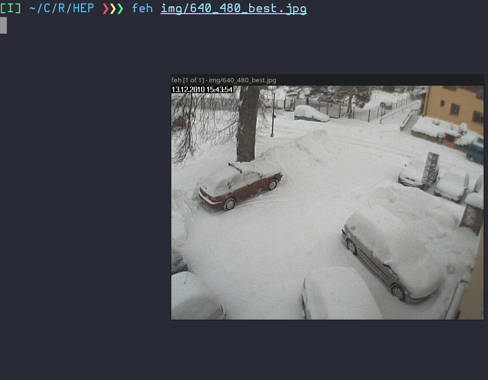

# HEP (Horizontally Extended Picture)

Horizontally Extended Picture (HEP) is an image format implemented entirely using C (with [raylib](https://www.raylib.com/)).



This is not inteded to be used as a serious image format as it doesn't have any upsides when compared to other formats, however, it does create some pretty interesting looking images.

Viewing the image can only be done using the 'decoder' binary.


## Prerequisites

- [Raylib](https://github.com/raysan5/raylib#build-and-installation).
- g++ (MinGW if you are on Windows)

## Installation

To get started with this project, clone the repository and compile the project using the provided `Makefile`.

```bash
git clone https://github.com/ikugo-dev/HEP.git
cd HEP
make
```
### ⚠️ **Warning for Windows users**
You need to have MinGW with gcc if you want to compile it.


## How to Use

### Encoding
Once compiled, drag and drop any image you want to convert to '.hep' into the 'encoder' (or 'encoder.exe') file.

You can also use the command line to specify the exact compression size as such
```bash
./encoder <file name> <compression rate>
```
where the compression rate can be anything above 1.

### Decoding
Once you have your '.hep' image ready, you can drag and drop (or use the command line) your '.hep' file over the 'decoder' (or 'decoder.exe') file in order to view it.

## Upcoming features:
- [ ] Zooming
- [ ] Saving back to .png
